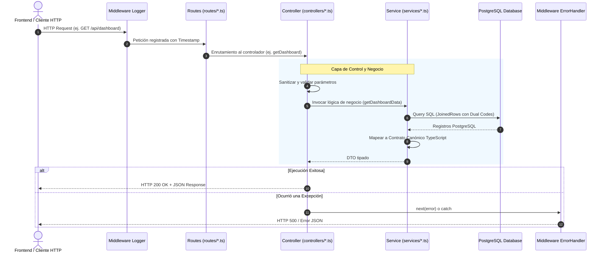

# 🏛️ Arquitectura del Backend - JuiciosEvaluativos

Bienvenido a la documentación de arquitectura del Backend de **JuiciosEvaluativos**. Este documento describe en detalle la estructura de carpetas, el flujo de datos, los principios de diseño y las convenciones que rigen el backend de la aplicación para que cualquier desarrollador pueda integrarse y extender el sistema de manera ágil y coherente.

---

## 🎯 1. Principios de Diseño

El backend está construido sobre **Node.js, Express, TypeScript y PostgreSQL**, siguiendo el patrón arquitectónico por capas (**Layered Architecture**) con **Principio de Responsabilidad Única (SRP)**:

1. **Separación de Responsabilidades (SoC)**: Cada capa tiene un propósito único y bien delimitado (Routing ➔ Request Handling ➔ Business Logic & DB Queries).
2. **Tipado Fuerte y Contrato Canónico**: Todos los intercambios de datos entre capas y con el frontend están respaldados por interfaces estrictas en TypeScript, garantizando que campos críticos como `codigo_juicio` y `codigo_proyecto` nunca sean ambiguos ni `undefined`.
3. **Manejo Centralizado de Errores**: Ninguna excepción no controlada tumba el proceso del servidor.
4. **Testabilidad Aislada**: Las pruebas unitarias, de integración y scripts de diagnóstico están modularizados en sus respectivas subcarpetas.

---

## 📂 2. Estructura Completa de Directorios

A continuación se presenta el árbol de directorios del módulo `Database/`:

```text
Database/
├── src/
│   ├── config/                      # Configuración e infraestructura externa
│   │   ├── db.ts                   # Pool de conexión a PostgreSQL (pg)
│   │   └── cors.d.ts               # Declaraciones de tipos para librerías
│   │
│   ├── types/                       # Contratos canónicos y definiciones de tipos
│   │   ├── curriculum.ts           # Interfaces canónicas de la jerarquía curricular
│   │   └── index.ts                # Barril de exportación de tipos
│   │
│   ├── middlewares/                 # Interceptores y middlewares de Express
│   │   ├── errorHandler.ts         # Middleware global para captura y formato de errores HTTP
│   │   ├── logger.ts               # Middleware de registro de peticiones con timestamp
│   │   └── upload.ts               # Configuración de Multer para archivos temporales (PDF/CSV)
│   │
│   ├── controllers/                 # Capa de controladores (HTTP Request / Response)
│   │   ├── dashboard.controller.ts # Controlador de métricas generales y filtros
│   │   ├── formation.controller.ts # Controlador del catálogo de formación y eliminación de fichas
│   │   ├── health.controller.ts    # Controlador de comprobación de salud y conexión DB
│   │   ├── import.controller.ts   # Controlador de importación CSV, extracción PDF y logs
│   │   ├── learner.controller.ts   # Controlador de consulta y detalle individual de aprendices
│   │   └── project.controller.ts   # Controlador CRUD de proyectos formativos, fases y asignaciones
│   │
│   ├── routes/                      # Definición modular de rutas Express
│   │   ├── dashboard.routes.ts     # /api/dashboard
│   │   ├── formation.routes.ts     # /api/formations/*
│   │   ├── health.routes.ts        # / y /api/health/*
│   │   ├── import.routes.ts        # /api/import/*, /api/extract/*, /api/logs/*
│   │   ├── learner.routes.ts       # /api/learners/*
│   │   ├── project.routes.ts       # /api/projects/*
│   │   └── index.ts                # Enrutador principal agregador montado bajo /api
│   │
│   ├── services/                    # Capa de lógica de negocio y consultas SQL a PostgreSQL
│   │   ├── csvImport.ts            # Procesamiento e inserción masiva transaccional de CSV
│   │   ├── dashboard.ts            # Agregaciones, métricas, rankings y catálogos
│   │   ├── formations.ts           # Eliminación en cascada de fichas de formación
│   │   ├── projects.ts             # Jerarquía de fases, asignaciones y analítica de desertores
│   │   └── schema.ts               # Migraciones automáticas y compatibilidad de esquema
│   │
│   ├── utils/                       # Utilidades puras reutilizables
│   │   ├── date-parser.ts          # Normalización y parseo estricto de fechas y horas (12h/24h AM/PM)
│   │   └── log-writer.ts           # Lectura y escritura de logs de auditoría en disco
│   │
│   ├── app.ts                       # Fábrica de la aplicación Express (middlewares y rutas)
│   └── index.ts                     # Entrypoint de arranque (Bootstrap, DB Check y listen)
│
└── tests/                           # Suite organizada de pruebas automatizadas y diagnóstico
    ├── unit/                        # Pruebas unitarias de funciones puras
    │   └── date-parser.test.ts     # Test de casos límite para horarios de SofiaPlus
    │
    ├── integration/                 # Pruebas de integración con la base de datos
    │   ├── assignment.test.ts      # Validación de asignación/desasignación de competencias
    │   ├── desertions.test.ts      # Validación de consultas de aprendices retirados/trasladados
    │   └── services.test.ts        # Validación de lectura de fases y proyectos
    │
    └── diagnostics/                 # Scripts de diagnóstico e inspección de datos
        └── check_counts.ts          # Conteo rápido de registros por tabla en vivo
```

---

## 🧩 3. Responsabilidad por Capa

### 1. `config/`
Contiene la configuración de conexión a la base de datos PostgreSQL utilizando `pg.Pool`. Gestiona credenciales desde variables de entorno y provee la instancia única de conexión compartida por los servicios.

### 2. `types/`
Define las interfaces TypeScript canónicas que sirven como **contrato estricto** en todo el sistema:
- `CurricularOutcome`: Identificador, códigos (`codigo_juicio`, `codigo_proyecto`), detalle y estado de aprobación.
- `CurricularCompetency`: Competencia con sus códigos duales obligatorios y su lista de resultados de aprendizaje.
- `CurricularActivity`: Agrupación de actividades numeradas dentro de cada fase.
- `CurricularPhase`: Fase del proyecto (`ANALISIS`, `PLANEACION`, `EJECUCION`, `EVALUACION`) con sus actividades y competencias.

### 3. `middlewares/`
- **`requestLogger`**: Imprime en consola cada solicitud entrante con su marca de tiempo ISO, verbo HTTP y URL.
- **`upload`**: Configuración de `multer` que almacena temporalmente los archivos adjuntos en `uploads/` para su posterior procesamiento.
- **`errorHandler`**: Atrapa cualquier error sincrónico o asincrónico no capturado, responde con código HTTP 500 y formato JSON consistente (`{ ok: false, error: message }`).

### 4. `controllers/`
Los controladores son la capa de entrada HTTP. Su única responsabilidad es:
1. Extraer y validar parámetros de la petición (`req.params`, `req.query`, `req.body`, `req.file`).
2. Invocar a los servicios de negocio correspondientes.
3. Responder con el código de estado HTTP adecuado (`200 OK`, `201 Created`, `400 Bad Request`, `404 Not Found`, etc.).
4. **No** ejecutan consultas SQL directas.

### 5. `routes/`
Agrupan los endpoints por dominio de negocio (`dashboard`, `learner`, `formation`, `project`, `import`, `health`). Cada archivo exporta un `Router` de Express que luego es consumido por `routes/index.ts`.

### 6. `services/`
Contienen las reglas de negocio, la lógica de agregación de datos y la ejecución de sentencias SQL mediante transacciones (`BEGIN`, `COMMIT`, `ROLLBACK`).
- Garantizan que las respuestas entreguen siempre los campos requeridos por el contrato TypeScript.
- Aplican algoritmos como la **Deducción Inteligente de Desertores** (`getPhaseLearnerStats`).

### 7. `utils/`
Funciones puras de utilidad sin dependencias de base de datos ni de Express:
- `parseJudgementDate`: Maneja con precisión formatos de fecha de SofiaPlus como `08/12/2025 18.16 a`, `08/12/2025 06.16 p`, `DD/MM/YYYY`, `HH:MM:SS`.
- `writeImportLog` / `listImportLogs`: Manejo de archivos JSON de auditoría en la carpeta `logs/`.

### 8. `app.ts` y `index.ts`
- **`app.ts`**: Crea e inicializa la instancia de `express()`, registra middlewares (`cors`, `json`, `urlencoded`, `logger`, `routes`, `errorHandler`). Es ideal para pruebas E2E sin levantar un socket de red.
- **`index.ts`**: Ejecuta el bootstrap del sistema (comprobación de esquema y migraciones con `ensureSchemaCompatibility`) y arranca el servidor HTTP escuchando en el puerto configurado.

---

## 🔄 4. Ciclo de Vida de una Petición (Request Lifecycle)

El siguiente diagrama ilustra cómo fluye una petición desde el cliente hasta la base de datos y de regreso:



---

## 🧪 5. Suite de Pruebas (`tests/`)

Las pruebas se encuentran divididas por tipología para permitir una ejecución rápida y focalizada:

| Carpeta | Propósito | Ejemplo de Comando |
| :--- | :--- | :--- |
| **`tests/unit/`** | Funciones utilitarias y parsers puros sin necesidad de base de datos activa. | `npx tsx Database/tests/unit/date-parser.test.ts` |
| **`tests/integration/`** | Pruebas de interacción entre servicios y base de datos PostgreSQL en vivo. | `npx tsx Database/tests/integration/services.test.ts` |
| **`tests/diagnostics/`** | Scripts de comprobación de salud, conteos de tablas y verificación de migraciones. | `npx tsx Database/tests/diagnostics/check_counts.ts` |

---

## 👩‍💻 6. Guía para Nuevos Desarrolladores: ¿Cómo agregar una nueva funcionalidad?

Si deseas agregar un nuevo módulo o endpoint al backend, sigue estos sencillos pasos:

1. **Definir Tipos (`types/`)**: Si la entidad requiere un nuevo contrato de datos, defínelo en `types/`.
2. **Implementar el Servicio (`services/`)**: Agrega la función en el archivo de servicio correspondiente con la consulta SQL o lógica transaccional.
3. **Crear el Controlador (`controllers/`)**: Crea una función que valide `req` y envíe la respuesta con `res.json()`.
4. **Registrar la Ruta (`routes/`)**: Asocia la URL y el verbo HTTP al controlador en su archivo de rutas respectivo.
5. **Escribir una Prueba (`tests/`)**: Añade un archivo de prueba unitaria o de integración en `tests/` para certificar el funcionamiento.
