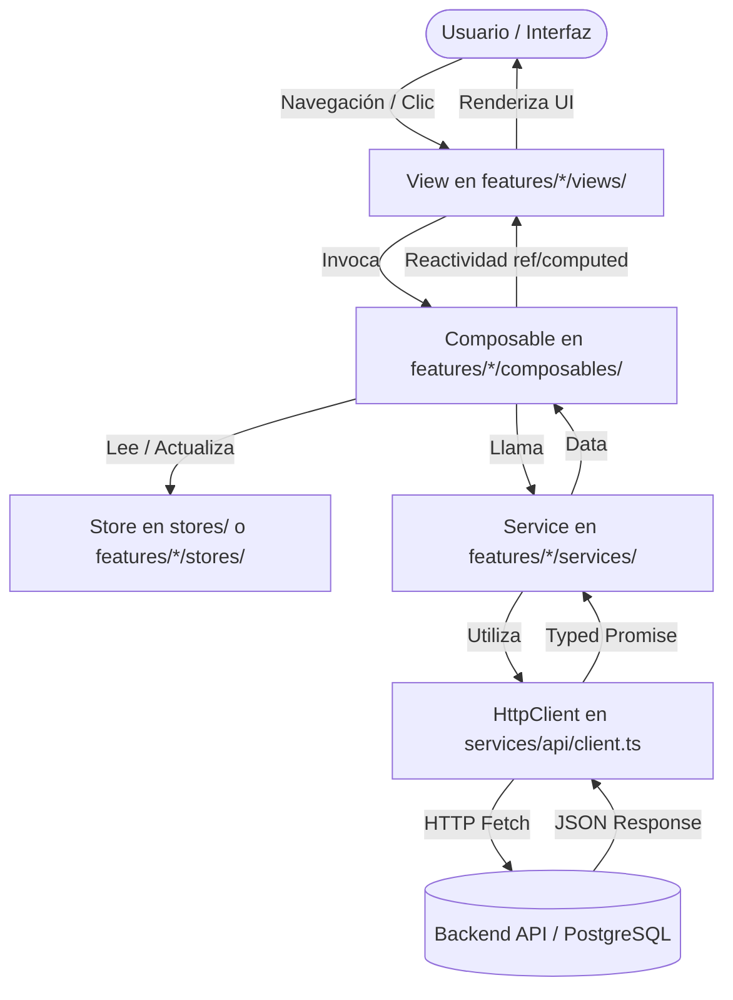

# 🏛️ Arquitectura del Frontend - JuiciosEvaluativos

Bienvenido a la documentación de arquitectura del Frontend de **JuiciosEvaluativos**. Este documento describe en detalle la estructura de carpetas, el flujo unidireccional de datos, los principios de diseño, la gestión del estado y las convenciones que rigen el frontend de la aplicación construido sobre **Vue 3, TypeScript, Pinia y Tailwind CSS**.

---

## 🎯 1. Principios de Diseño

El frontend implementa una arquitectura híbrida **Feature-Driven / Vertical Slice Architecture** con capas de infraestructura transversal, diseñada para garantizar:

1. **Separación Estricta de Responsabilidades (SoC)**:
   - **Vistas (`views/`)**: Orquestación y composición de alto nivel conectada a rutas de Vue Router.
   - **Componentes (`components/`)**: Elementos visuales y de interacción desacoplados.
   - **Composables (`composables/`)**: Lógica reactiva, watchers, cómputos y coordinación de servicios.
   - **Servicios (`services/`)**: Abstracción de red y llamadas a la API backend.
   - **Stores (`stores/`)**: Gestión de estado global y transversal mediante Pinia.
   - **Utilidades (`utils/`)**: Funciones puras e independientes de framework (formatters, exporters, search).
2. **Alta Cohesión y Bajo Acoplamiento**: Todo el código perteneciente a un dominio de negocio (p. ej. `academic-tracking`, `project-phases`, `imports`) reside encapsulado dentro de su respectiva carpeta en `src/features/`.
3. **Contratos Canónicos Tipados**: Se definen tipos estrictos e inmutables en `src/types/` compartidos con el backend (`CurricularOutcome`, `CurricularCompetency`, `CurricularPhase`).
4. **Screaming Architecture**: La estructura del proyecto refleja directamente el dominio formativo y los casos de uso del sistema.
5. **No a la Sobrearquitectura**: Cada capa y subcarpeta se crea únicamente cuando existe una responsabilidad real que justificar.

---

## 📂 2. Estructura Completa de Directorios

A continuación se presenta el árbol de directorios de `src/`:

```text
src/
├── app/                                 # Infraestructura de arranque y composición global
│   ├── config/                          # Configuración de variables de entorno
│   │   └── env.ts                       # VITE_API_URL centralizado
│   └── router/                          # Enrutamiento con Vue Router
│       ├── index.ts                     # Instancia del router, scrollBehavior y document.title
│       └── routes.ts                    # Definición de rutas con lazy loading (/import, /dashboard, etc.)
│
├── assets/                              # Recursos estáticos y estilos globales
│   └── styles/                          # Hojas de estilo Tailwind
│
├── components/                          # Componentes UI reutilizables y compartidos
│   ├── common/                          # Componentes de estado (Loading, EmptyState, StatCards)
│   ├── layout/                          # Layout global (AppHeader.vue)
│   └── ui/                              # Elementos base atómicos (BaseModal, BaseButton, BaseSelect)
│
├── features/                            # MÓDULOS DE NEGOCIO ENCAPSULADOS (Vertical Slices)
│   │
│   ├── imports/                         # Dominio de Importación de Archivos (CSV / Excel)
│   │   ├── composables/                 # useFileParser.ts (PapaParse + SheetJS aislado)
│   │   ├── services/                    # import.service.ts (/api/import/csv, /api/formations/:ficha)
│   │   ├── stores/                      # importHistory.store.ts (Persistencia en localStorage)
│   │   └── views/                       # Vistas del módulo
│   │       ├── ImportWorkspaceView.vue  # Dropzone, preview tabular y borrado de fichas
│   │       └── ImportsHistoryModal.vue  # Modal con historial de archivos cargados
│   │
│   ├── dashboard/                       # Dominio Panorama Ejecutivo y Métricas
│   │   ├── composables/                 # useDashboard.ts (Cálculo de rankings y filtros)
│   │   ├── services/                    # dashboard.service.ts (/api/dashboard)
│   │   └── views/                       # Vistas del módulo
│   │       └── DashboardGeneralView.vue # Gráficos Doughnut/Bar y tabla de aprendices pendientes
│   │
│   ├── academic-tracking/               # Dominio de Seguimiento Curricular por Competencias y Aprendiz
│   │   ├── components/                  # ResultDetailModal.vue (Modal de evaluación y exportadores)
│   │   ├── composables/                 # useAcademicTracking.ts (Catálogo y detalle individual)
│   │   ├── services/                    # tracking.service.ts (/api/learners/:id, /api/formations/competencies)
│   │   └── views/                       # Vistas del módulo
│   │       └── AcademicTrackingView.vue # Catálogo general, acordeones multinivel y detalle de aprendiz
│   │
│   └── project-phases/                  # Dominio de Fases del Proyecto Formativo y PDF
│       ├── services/                    # projectPhases.service.ts (/api/projects, /api/extract/project)
│       └── views/                       # Vistas del módulo
│           ├── ProjectPhasesView.vue    # Grid de proyectos y subida de PDF
│           └── ProjectPhasesDetailView.vue # Jerarquía de fases, asignación de competencias y analítica
│
├── services/                            # Infraestructura HTTP y clientes base
│   └── api/
│       ├── client.ts                    # HttpClient tipado (fetch wrapper con params, json y formData)
│       └── errors.ts                    # Clase de error personalizada ApiError
│
├── stores/                              # Estado Global Transversal Pinia
│   └── academicContext.store.ts         # Ficha seleccionada, aprendiz activo y filtros globales
│
├── types/                               # Contratos Canónicos Globales Transversales
│   ├── api.types.ts                     # ApiResponse, ApiErrorResponse
│   ├── curriculum.types.ts              # CurricularOutcome, CurricularCompetency, CurricularPhase
│   └── index.ts                         # Barril de exportación de contratos canónicos
│
├── utils/                               # Funciones puras independientes del framework
│   ├── exporters/                       # Exportación a documentos binarios
│   │   ├── excelReport.ts               # Generación de reportes XLSX (SheetJS)
│   │   └── pdfReport.ts                 # Generación de reportes PDF (jsPDF + AutoTable)
│   ├── formatters/                      # Formateadores
│   │   ├── date.ts                      # formatDate, formatDateTimeLong
│   │   └── number.ts                    # formatPercent, prettyState, formatBytes
│   └── search/                          # textNormalizer.ts (búsquedas sin tildes ni mayúsculas)
│
├── App.vue                              # Componente raíz (Layout Maestro con <router-view />)
├── main.ts                              # Bootstrap de la aplicación (Pinia + Vue Router + Tailwind)
└── style.css                            # Configuración de estilos base y utilidades
```

---

## 🔄 3. Flujo Canónico de Responsabilidades

El frontend sigue un flujo unidireccional y predecible de datos:



---

## 🧩 4. Responsabilidad Detallada por Módulo y Capa

### 1. `app/` (Configuración e Infraestructura Global)
- **`app/config/env.ts`**: Centraliza variables de entorno (`apiUrl: import.meta.env.VITE_API_URL ?? 'http://localhost:4000'`).
- **`app/router/`**: Configura Vue Router con historial HTML5 (`createWebHistory`), carga perezosa (`lazy loading`), manejo de títulos de pestaña y rutas canónicas:
  - `/import` ➔ `ImportWorkspaceView`
  - `/phases` ➔ `ProjectPhasesView`
  - `/dashboard` ➔ `DashboardGeneralView`
  - `/tracking` ➔ `AcademicTrackingView`

### 2. `services/api/` (Transporte HTTP)
- **`client.ts`**: Cliente HTTP unificado construido sobre la Fetch API estándar. Soporta métodos `get()`, `post()`, `put()`, `delete()`, serialización automática de `FormData` y `JSON`, inyección de parámetros URL (`QueryParams`) y tipado genérico de respuestas.
- **`errors.ts`**: Encapsula excepciones HTTP con códigos de estado (`status`) y detalles devueltos por el backend en la clase `ApiError`.

### 3. `stores/` (Estado Global Compartido)
- **`academicContext.store.ts`**: Store Pinia global transversal. Mantiene la **Ficha Activa** (`selectedFicha`), el **Aprendiz Seleccionado** (`selectedLearnerId`) y los filtros globales compartidos entre el Dashboard y el Seguimiento Curricular.

### 4. `features/imports/` (Carga y Validación de Archivos)
- **`useFileParser.ts`**: Composable que abstrae el parsing de archivos `.csv` (PapaParse) y libros `.xlsx/.xls` (SheetJS), normalizando encabezados y detectando la fila de metadatos de SofiaPlus.
- **`importHistory.store.ts`**: Administra el historial de importaciones almacenado en `localStorage` mediante fingerprints SHA-256 para evitar subidas duplicadas.
- **`import.service.ts`**: Gestiona el endpoint `/api/import/csv` y la eliminación en cascada de fichas `/api/formations/:ficha`.

### 5. `features/dashboard/` (Panorama General y Gráficos)
- **`useDashboard.ts`**: Orquesta la carga de métricas, opciones de filtrado y rankings analíticos.
- **`DashboardGeneralView.vue`**: Presenta tarjetas de resumen, gráficos de donas y barras con Chart.js y tabla interactiva de aprendices con juicios pendientes que redirige al seguimiento individual.

### 6. `features/academic-tracking/` (Seguimiento Curricular)
- **`useAcademicTracking.ts`**: Administra el catálogo curricular general y el detalle por aprendiz individual.
- **`ResultDetailModal.vue`**: Modal de inspección de aprendices por resultado de aprendizaje, integrando exportación a PDF y Excel sin acoplar la vista principal.
- **`AcademicTrackingView.vue`**: Vista modularizada con selector lateral, acordeones de competencias y visualización dual (Catálogo vs Aprendiz).

### 7. `features/project-phases/` (Fases del Proyecto Formativo)
- **`projectPhases.service.ts`**: Comunicación con el extractor de PDF en Python (`/api/extract/project`), jerarquía de fases y asignación matricial de competencias.
- **`ProjectPhasesDetailView.vue`**: Vista de detalle organizada en Actividades de Proyecto ➔ Competencias ➔ RAPs con gráfico de tendencias de deserción.

### 8. `utils/` (Helpers Puros e Independientes)
- **`exporters/`**: Módulos independientes para generar reportes binarios en el cliente:
  - `excelReport.ts`: Construcción de hojas de cálculo formateadas con `xlsx`.
  - `pdfReport.ts`: Generación de PDFs vectoriales con `jspdf` y `jspdf-autotable`.
- **`formatters/`**: `date.ts` (`formatDate`), `number.ts` (`formatPercent`, `prettyState`, `formatBytes`).
- **`search/`**: `textNormalizer.ts` (`normalizeSearchValue` para búsquedas insensibles a mayúsculas y tildes).

---

## 📋 5. Convenciones de Nomenclatura

| Tipo de Archivo | Convención | Ubicación | Ejemplo |
| :--- | :--- | :--- | :--- |
| **Vistas** | `PascalCase` con sufijo `View.vue` | `src/features/<feature>/views/` | `AcademicTrackingView.vue` |
| **Componentes** | `PascalCase.vue` | `src/components/` o `features/*/components/` | `ResultDetailModal.vue` |
| **Composables** | `camelCase` con prefijo `use` | `src/features/<feature>/composables/` | `useFileParser.ts` |
| **Servicios** | `camelCase` con sufijo `.service.ts` | `src/features/<feature>/services/` | `tracking.service.ts` |
| **Stores Pinia** | `camelCase` con sufijo `.store.ts` | `src/stores/` o `features/*/stores/` | `academicContext.store.ts` |
| **Contratos Types** | `camelCase` con sufijo `.types.ts` o `.ts` | `src/types/` | `curriculum.types.ts` |
| **Utilidades** | `camelCase.ts` | `src/utils/<category>/` | `textNormalizer.ts` |

---

## ✅ 6. Checklist para Desarrollar Nuevas Funcionalidades

Antes de añadir una nueva pantalla o funcionalidad al frontend:

- [ ] Identificar a qué `feature` pertenece el dominio de negocio.
- [ ] Mantener los componentes específicos dentro de `features/<feature>/components/`.
- [ ] Colocar las vistas enlazables en `features/<feature>/views/` y registrar la ruta en `src/app/router/routes.ts`.
- [ ] Implementar la comunicación con el backend dentro de `features/<feature>/services/<feature>.service.ts` usando `apiClient`.
- [ ] Extraer la lógica reactiva y watchers a un composable `use<Feature>.ts`.
- [ ] Utilizar el store `useAcademicContextStore` si se requiere compartir contexto de ficha o aprendiz con otras vistas.
- [ ] Reutilizar formatters desde `src/utils/formatters/` en lugar de duplicar funciones locales.
- [ ] Validar que `npm run build` y `vue-tsc -b` compilen con 0 errores.
