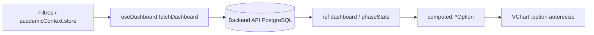

# 📈 Catálogo y Guía Técnica de Gráficas Interactivas del Sistema

Este documento recopila la totalidad de las **gráficas interactivas** implementadas en el sistema **JuiciosEvaluativos**, detallando su biblioteca de renderizado, propósito de negocio, origen de datos, opciones de configuración reactiva y directrices para su mantenimiento y extensión.

---

## 🏛️ 1. Resumen Tecnológico y Librerías

El sistema utiliza dos bibliotecas de visualización de datos de alto rendimiento:

| Librería | Motor de Renderizado | Propósito en el Sistema |
| :--- | :--- | :--- |
| **Apache ECharts (`vue-echarts` + `echarts/core`)** | Canvas / SVG reactivo | Gráficos ejecutivos multidimensionales del Dashboard (Gauge, Radar, Donut, Bar apilado, Bar horizontal). |
| **Chart.js (`vue-chartjs` + `chart.js`)** | HTML5 Canvas | Gráficos de tendencias analíticas en el módulo de Fases del Proyecto (`ProjectPhasesDetailView.vue`). |

---

## 📊 2. Catálogo Detallado de Gráficas por Módulo

### 1. Panel Panorama General (`DashboardGeneralView.vue` - Tab 1)

#### 🎯 1.1 Tacómetro de Avance Curricular (*Gauge Chart*)
- **Identificador**: `gaugeOption`
- **Librería / Motor**: Apache ECharts (`GaugeChart`)
- **Propósito**: Representar de forma inmediata el nivel de avance global de la ficha o programa activo mediante un velocímetro semicircular (180° a 0°).
- **Zonas de Color**:
  - 🔴 **0% - 40%** (`#e11d48`): Nivel crítico / inicio de etapa.
  - 🟡 **40% - 75%** (`#d97706`): Nivel medio en desarrollo.
  - 🟢 **75% - 100%** (`#059669`): Alto nivel de cumplimiento.
- **Origen de Datos**: `dashboard.overview.averageProgress`.
- **Propiedades de Renderizado**:
  - `startAngle: 180`, `endAngle: 0`, `radius: '110%'`
  - Aguja personalizada (`pointer`) centrada con animación reactiva de valor (`valueAnimation: true`).

---

#### 🕸️ 1.2 Radar Multidimensional de Competencias (*Radar Chart*)
- **Identificador**: `radarOption`
- **Librería / Motor**: Apache ECharts (`RadarChart`)
- **Propósito**: Comparar simultáneamente la tasa de aprobación porcentual (0% a 100%) entre las principales competencias de la ficha.
- **Origen de Datos**: `dashboard.competencies.slice(0, 6)`.
- **Propiedades de Renderizado**:
  - Área sombreada semitransparente (`rgba(5, 150, 105, 0.25)`).
  - Borde esmeralda (`#059669`, grosor 2.5px).
  - Tooltip formateador dinámico que desglosa el porcentaje exacto de cada competencia al posar el cursor sobre el polígono.

---

#### 🍩 1.3 Dona de Estado de Aprendices (*Donut Chart*)
- **Identificador**: `donutOption`
- **Librería / Motor**: Apache ECharts (`PieChart`)
- **Propósito**: Visualizar la proporción de la matrícula activa vs novedades de deserción y traslado.
- **Segmentos**:
  - 🟢 **En Formación** (`#059669`): `dashboard.overview.inTrainingCount`.
  - 🟡 **Traslado** (`#d97706`): `dashboard.overview.transferredCount`.
  - 🔴 **Retiro Voluntario** (`#e11d48`): `dashboard.overview.retiredCount`.
- **Propiedades de Renderizado**:
  - Radio interno y externo (`radius: ['52%', '78%']`) con borde blanco de separación (`borderWidth: 2`).

---

#### 🍩 1.4 Dona de Proporción de Juicios Evaluativos (*Donut Chart*)
- **Identificador**: `donutJudgementsOption`
- **Librería / Motor**: Apache ECharts (`PieChart`)
- **Propósito**: Monitorear el volumen global de juicios calificados vs pendientes de calificación en la cohorte.
- **Segmentos**:
  - 🟢 **Aprobados** (`#059669`): `dashboard.overview.approvedJudgements`.
  - 🟡 **Por Evaluar** (`#d97706`): `dashboard.overview.pendingJudgements`.
  - 🔴 **No Aprobados** (`#e11d48`): `dashboard.overview.disapprovedJudgements`.

---

### 2. Panel de Fases del Proyecto (`DashboardGeneralView.vue` - Tab 2)

#### 📊 2.1 Cumplimiento por Fase Pedagógica (*Bar Chart*)
- **Identificador**: `phaseProgressChartOption`
- **Librería / Motor**: Apache ECharts (`BarChart`)
- **Propósito**: Comparar el porcentaje de logro obtenido en cada una de las 4 fases formativas (`Análisis`, `Planeación`, `Ejecución`, `Evaluación`).
- **Coloreado Dinámico**: La barra cambia de color según el umbral alcanzado: Verde (≥75%), Ámbar (40-74%), Rojo (<40%).
- **Origen de Datos**: `phaseStats` (`projectPhasesService.getPhaseLearnerStats`).

---

#### 📉 2.2 Curva de Deserción por Fase (*Line Chart con Área*)
- **Identificador**: `phaseDesertionChartOption`
- **Librería / Motor**: Apache ECharts (`LineChart`)
- **Propósito**: Identificar el punto de inflexión donde se concentran los retiros y traslados de aprendices a lo largo de la ruta pedagógica.
- **Origen de Datos**: `phaseStats.map(s => s.desertedCount)`.
- **Propiedades de Renderizado**:
  - Línea carmesí suave (`#e11d48`, `smooth: true`) con relleno de área gradiente (`rgba(225, 29, 72, 0.2)`).

---

#### 🧱 2.3 Actividades Estructuradas por Fase (*Bar Chart*)
- **Identificador**: `phaseActivitiesBarOption`
- **Librería / Motor**: Apache ECharts (`BarChart`)
- **Propósito**: Ilustrar la densidad de actividades de proyecto definidas en cada fase del proyecto formativo.
- **Origen de Datos**: `phaseStats.map(s => s.totalExpectedResults)`.

---

### 3. Panel de Métricas por Aprendiz (`DashboardGeneralView.vue` - Tab 3)

#### 👤 3.1 Radar de Competencias Individual (*Radar Chart*)
- **Identificador**: `learnerIndividualRadarOption`
- **Librería / Motor**: Apache ECharts (`RadarChart`)
- **Propósito**: Desplegar el perfil de dominio del aprendiz seleccionado, mapeando sus competencias evaluadas en una escala poligonal de 0% a 100%.
- **Origen de Datos**: `learnerDetail.competencies` (`GET /api/learners/:learnerId`).

---

#### 📊 3.2 Barras de Avance por Competencia del Aprendiz (*Horizontal Bar Chart*)
- **Identificador**: `learnerCompetencyBarOption`
- **Librería / Motor**: Apache ECharts (`BarChart`)
- **Propósito**: Mostrar el progreso individual norma por norma del estudiante para emitir recomendaciones en comités de evaluación.

---

### 4. Panel de Análisis de Competencias (`DashboardGeneralView.vue` - Tab 4)

#### 📈 4.1 Ranking de Aprobación por Competencia (*Horizontal Bar Chart*)
- **Identificador**: `competencyApprovalBarOption`
- **Librería / Motor**: Apache ECharts (`BarChart`)
- **Propósito**: Listar las competencias ordenadas por mayor tasa de aprobación con barras coloreadas según el nivel de logro.
- **Origen de Datos**: `dashboard.competencies.slice(0, 10)`.

---

#### ⚠️ 4.2 Detección de Cuellos de Botella / Juicios Pendientes (*Horizontal Bar Chart*)
- **Identificador**: `pendingCompetenciesBarOption`
- **Librería / Motor**: Apache ECharts (`BarChart`)
- **Propósito**: Destacar en color ámbar las normas que acumulan el mayor número de juicios por evaluar para priorizar la atención docente.
- **Origen de Datos**: `visibleCompetenciesByPending` (ordenadas por `pending` descendente).

---

#### 🧱 4.3 Matriz de Distribución 100% Apilada por Competencia (*Stacked Bar Chart*)
- **Identificador**: `competencyDistributionStackedOption`
- **Librería / Motor**: Apache ECharts (`BarChart` apilado)
- **Propósito**: Entregar una **radiografía integral de toda la ficha** mostrando cada competencia dividida en 3 segmentos proporcionales al 100%:
  - 🟢 **Verde Esmeralda (`#059669`)**: % de juicios Aprobados.
  - 🟡 **Ámbar (`#d97706`)**: % de juicios Por Evaluar / Pendientes.
  - 🔴 **Rojo Carmesí (`#e11d48`)**: % de juicios No Aprobados / Desaprobados.
- **Origen de Datos**: `dashboard.competencies`.
- **Propiedades de Renderizado**:
  - `stack: 'total'`, `barMaxWidth: 22`, `boundaryGap: true`.
  - Etiquetas numéricas internas de porcentaje (`{c}%`).
  - Tooltip flotante con desglose cuantitativo (`Aprobados: N (X%)`, `Pendientes: N (Y%)`, `No Aprobados: N (Z%)` y `Total: N`).

---

### 5. Detalle del Proyecto Formativo (`ProjectPhasesDetailView.vue`)

#### 📉 5.1 Tendencia de Deserción Curricular (*Chart.js Line Chart*)
- **Identificador**: `desertionChartData` / `desertionChartOptions`
- **Librería / Motor**: Vue Chart.js (`Line`)
- **Propósito**: Graficar en el visor curricular la deserción histórica a lo largo de las 4 fases pedagógicas del SENA.
- **Origen de Datos**: `learnerStats` (`projectPhasesService.getPhaseLearnerStats`).
- **Propiedades de Renderizado**:
  - Borde carmesí (`#e11d48`, ancho 3px), puntos circulares con borde blanco (`pointBorderWidth: 2`).
  - Tooltip personalizado que desglosa en cada fase: `Total: N`, `Traslados: N`, `Retiros Voluntarios: N`.

---

## 🎨 3. Paleta Cromática Institucional Estandarizada

Para preservar la armonía visual y consistencia de diseño, todas las gráficas del sistema utilizan exclusivamente la siguiente paleta:

| Concepto | Hexadecimal | RGB / Alpha | Uso en Gráficas |
| :--- | :--- | :--- | :--- |
| **Aprobado / Éxito** | `#059669` | `rgba(5, 150, 105, 1)` | Barras de aprobación, segmentos de dona, área de radar. |
| **Por Evaluar / Advertencia** | `#d97706` | `rgba(217, 119, 6, 1)` | Juicios pendientes, cuellos de botella, aprendices en riesgo. |
| **Desaprobado / Deserción** | `#e11d48` | `rgba(225, 29, 72, 1)` | Juicios no aprobados, curvas de deserción, retiros voluntarios. |
| **Fondos de Tooltip** | `#0f172a` | `rgba(15, 23, 42, 1)` | Tarjetas oscuras flotantes con tipografía blanca (`#ffffff`). |
| **Líneas de Grilla** | `#f1f5f9` | `rgba(241, 245, 249, 1)` | Divisiones sutiles de fondo en ejes X e Y. |

---

## 🔄 4. Ciclo de Vida y Reactividad

Todas las gráficas en el frontend están conectadas al flujo reactivo unidireccional de Vue 3:

1. **Auto-Resize**: Todos los componentes `<VChart>` y `<Line>` tienen activa la directiva `autoresize`, garantizando adaptación fluida ante cambios de tamaño de ventana o alternancia entre pestañas.
2. **Aislamiento de Cómputo**: Cada gráfico está encapsulado en un `computed()`, recalculándose únicamente cuando cambia la propiedad de datos específica requerida.
3. **Manejo de Estados Vacíos**: Si el conjunto de datos está vacío, la opción del gráfico renderiza un título centrado informativo (*"Sin datos disponibles"*) sin emitir advertencias en la consola del navegador.
