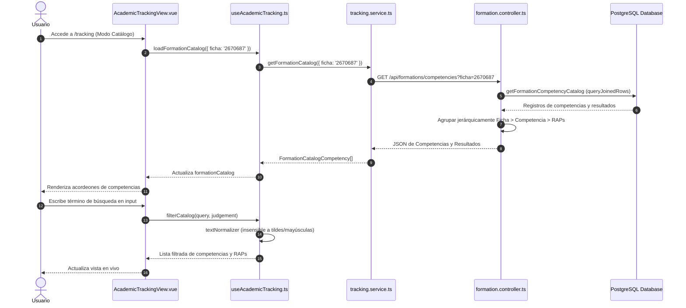

# 🔄 Casos de Uso - Módulo de Seguimiento Curricular (Academic Tracking)

---

# CU-TRK-001: Consulta y Exploración del Catálogo de Competencias por Ficha

## 1. Descripción
Permite al docente o directivo navegar por el catálogo curricular completo de una ficha de caracterización, inspeccionando los niveles de logro de cada resultado de aprendizaje mediante acordeones interactivos y búsqueda predictiva.

## 2. Actores
- **Principal**: Instructor / Coordinador Académico
- **Secundario**: Servidor Backend (API PostgreSQL)

## 3. Precondiciones
- El usuario accede a la ruta `/tracking`.
- Existe al menos una ficha de caracterización con juicios evaluativos cargada en el sistema.

## 4. Diagrama de Secuencia

## 5. Flujo Principal (Happy Path)
1. El usuario ingresa a `/tracking`.
2. Por defecto se activa la pestaña *"Catálogo de Formación"*.
3. El composable `useAcademicTracking` solicita las competencias de la ficha activa llamando a `GET /api/formations/competencies?ficha={selectedFicha}`.
4. El backend agrupa las filas en una estructura jerárquica:
   - Para cada competencia: Código, Denominación, Totales de Aprendices, Aprobados, Pendientes y Progreso %.
   - Para cada RAP: Código, Detalle, Totales y Lista de Aprendices con sus respectivos juicios.
5. El frontend renderiza las tarjetas de competencias con barras de progreso.
6. El usuario hace clic en una competencia para expandir sus resultados de aprendizaje.
7. El usuario utiliza el buscador escribiendo palabras clave (ej. `"datos"`, `"calidad"` o códigos numéricos).
8. La función `filterCatalog` aplica la normalización de texto y muestra instantáneamente las competencias y RAPs coincidentes.

## 6. Flujos Alternativos
- **A1: Filtrar solo resultados pendientes**: El usuario selecciona el filtro *"Por Evaluar"*. El catálogo oculta los RAPs cuyos aprendices estén 100% aprobados y muestra únicamente aquellos que tienen juicios pendientes de calificar.
- **A2: Abrir modal de detalle**: El usuario hace clic sobre un RAP específico, disparando el caso de uso `CU-TRK-003`.

## 7. Flujos de Excepción
- **E1: Ficha sin competencias o vacía**: Si la ficha no tiene registros o no existe, el backend retorna un arreglo vacío `[]` y el frontend muestra el mensaje de estado: *"No se encontraron competencias asociadas a esta ficha."*
- **E2: Error de red o servidor**: Se presenta un aviso de alerta en la vista con opción de reintentar la consulta.

---

# CU-TRK-002: Consulta del Detalle Curricular Individual de un Aprendiz

## 1. Descripción
Permite al instructor o evaluador consultar la hoja de vida académica individual de un aprendiz, revisando su progreso, resultados aprobados/pendientes y funcionarios evaluadores.

## 2. Actores
- **Principal**: Instructor / Evaluador / Comité de Evaluación

## 3. Precondiciones
- El usuario selecciona la pestaña *"Por Aprendiz"* en `/tracking` o proviene de una redirección directa desde el Dashboard.

## 4. Flujo Principal (Happy Path)
1. El usuario activa la vista *"Por Aprendiz"*.
2. El selector de aprendices muestra a todos los estudiantes pertenecientes a la ficha activa ordenados alfabéticamente.
3. El usuario selecciona a un aprendiz de la lista o escribe su número de documento en el buscador.
4. Se invoca el endpoint `GET /api/learners/:learnerId`.
5. El backend ejecuta `getLearnerDetail` y retorna:
   - Datos personales y estado (`documento`, `nombres`, `apellidos`, `estado`, `ficha`, `programa`).
   - Contadores consolidados de resultados (`totalResults`, `approvedResults`, `pendingResults`, `disapprovedResults`, `progress`).
   - Arreglo de competencias con sus resultados, juicios (`aprobado`, `por evaluar`, etc.), marcas de fecha y funcionarios evaluadores.
6. El frontend renderiza la tarjeta resumen del estudiante y los acordeones de competencias (desplegando automáticamente las dos primeras competencias).
7. Cada RAP exhibe un badge visual de estado, la fecha formateada en horario de Colombia y el funcionario que registró el juicio.

## 5. Flujos de Excepción
- **E1: Aprendiz no encontrado**: Si se proporciona un ID inexistente en la URL, el backend retorna código 404 (`{ error: 'No se encontro el aprendiz solicitado.' }`) y la vista muestra un mensaje de error claro invitando a seleccionar otro estudiante.

---

# CU-TRK-003: Inspección y Exportación de Aprendices por Resultado (Modal)

## 1. Descripción
Permite abrir un modal interactivo sobre un resultado de aprendizaje para inspeccionar la lista completa de aprendices y exportar planillas de evaluación a formato Excel (`.xlsx`) o actas formales en PDF (`.pdf`).

## 2. Actores
- **Principal**: Instructor / Coordinador Académico
- **Secundario**: Motor de Exportación en Cliente (`SheetJS` / `jsPDF`)

## 3. Precondiciones
- El usuario se encuentra en el catálogo formativo y hace clic en un resultado de aprendizaje.

## 4. Flujo Principal (Happy Path)
1. El usuario pulsa sobre un resultado de aprendizaje en el catálogo.
2. Se abre el modal `ResultDetailModal.vue` cargado con los datos del RAP (`code`, `detail`, `learners`, `progress`).
3. El modal muestra la tira de contadores: Total Aprendices, Aprobados, Pendientes y Cumplimiento %.
4. El usuario puede aplicar un filtro de juicio evaluativo para visualizar, por ejemplo, únicamente a los aprendices con estado `'por evaluar'`.
5. **Para exportar a Excel**:
   - El usuario hace clic en el botón **"Excel"**.
   - Se ejecuta `exportResultToExcel` en `excelReport.ts`.
   - Se genera el archivo `Reporte_Ficha_{ficha}_RAP_{codigo}.xlsx` en memoria y se descarga automáticamente en el navegador.
6. **Para exportar a PDF**:
   - El usuario hace clic en el botón **"PDF"**.
   - Se ejecuta `exportResultToPdf` en `pdfReport.ts`.
   - Se construye el documento PDF vectorial con estilos institucionales SENA y tabla paginada.
   - Se descarga inmediatamente el archivo `Reporte_Ficha_{ficha}_RAP_{codigo}.pdf`.
7. El usuario cierra el modal haciendo clic en "Cerrar" o presionando Escape.

## 5. Flujos Alternativos
- **A1: Exportación con filtro activo**: Si el usuario seleccionó previamente un filtro de juicio (ej. `'por evaluar'`), el archivo Excel o PDF exportado contendrá únicamente a los aprendices que coincidan con dicho filtro.
