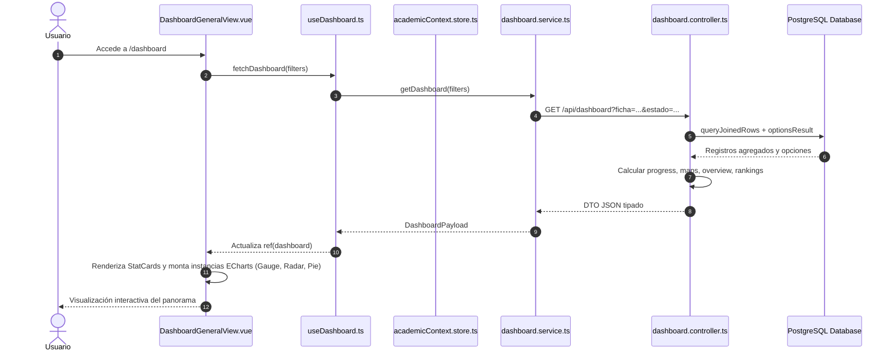

# 🔄 Casos de Uso - Módulo de Panorama Ejecutivo y Métricas (Dashboard)

---

# CU-DSH-001: Consulta del Dashboard General y Exploración de Métricas

## 1. Descripción
Permite a directivos, coordinadores e instructores consultar el estado general de las fichas de caracterización, interactuar con los gráficos de Apache ECharts y analizar el nivel de avance curricular.

## 2. Actores
- **Principal**: Coordinador Académico / Instructor / Directivo
- **Secundario**: Servidor Backend (API PostgreSQL)

## 3. Precondiciones
- El usuario accede a la ruta `/dashboard`.
- Existen fichas y juicios evaluativos importados en la base de datos.

## 4. Diagrama de Secuencia

## 5. Flujo Principal (Happy Path)
1. El usuario navega a `/dashboard`.
2. El composable `useDashboard` lee los filtros activos desde el store transversal `academicContext.store` (ej. ficha seleccionada previamente).
3. Se realiza una petición HTTP `GET /api/dashboard` con los parámetros sanitizados.
4. El backend ejecuta las consultas SQL agregando la información de programas, formaciones, aprendices, competencias, resultados y juicios.
5. El backend devuelve el payload consolidado estructurado en: `overview`, `programs`, `learners`, `competencies`, `pendingLearners`, `recentJudgements`, y `options`.
6. El frontend procesa las propiedades computadas:
   - Configura el gráfico *Gauge* con el porcentaje de avance general.
   - Configura el gráfico *Radar* con las competencias y sus tasas de aprobación.
   - Configura el gráfico *Donut* con la distribución de aprendices por estado.
   - Configura los gráficos de barras con las competencias rezagadas.
7. Se renderiza la tabla de aprendices con juicios pendientes y el feed de auditoría de juicios recientes.
8. El usuario puede cambiar de pestañas (*Panorama General*, *Fases del Proyecto*, *Métricas por Aprendiz*, *Competencias*) para profundizar en la información.

## 6. Flujos Alternativos
- **A1: Cambio de Ficha en la Barra de Filtros**:
  1. El usuario selecciona una ficha diferente en el selector superior (ej. `2670688`).
  2. `academicStore.setFicha('2670688')` actualiza el store global.
  3. `useDashboard.fetchDashboard({ ficha: '2670688' })` vuelve a consultar el backend con el nuevo filtro.
  4. Todos los gráficos, rankings y contadores se recalculan automáticamente para la cohorte elegida.
- **A2: Transición a Seguimiento Curricular desde Aprendiz Pendiente**:
  1. En la tabla de aprendices con juicios pendientes, el usuario hace clic en el botón "Inspeccionar" de un aprendiz.
  2. El sistema almacena el `selectedLearnerId` en `academicContext.store`.
  3. El router navega a `/tracking`.
  4. La vista de seguimiento curricular carga de inmediato la ficha individual del aprendiz seleccionado.

## 7. Flujos de Excepción
- **E1: No hay datos importados en el sistema**:
  - Si la base de datos está vacía, el backend devuelve contadores en 0 y arreglos vacíos.
  - La vista detecta `dashboard.overview.learnerCount === 0` y muestra el componente `EmptyState` invitando a importar un archivo en `/import`.
- **E2: Error de conexión con el servidor**:
  - Si el backend responde HTTP 500 o la red falla, se captura el error y se presenta un banner rojo de alerta con la opción de reintentar la carga.

## 8. Postcondiciones
- El usuario dispone de la información diagnóstica consolidada de la ficha o programa.
- El contexto académico (`selectedFicha`) queda sincronizado para las demás pantallas del sistema.
