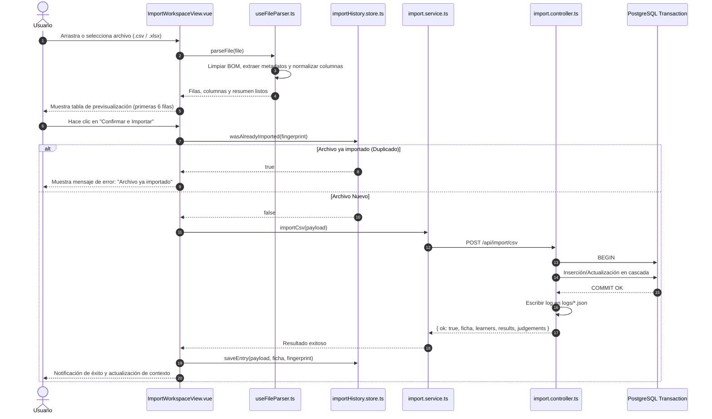

# 🔄 Casos de Uso - Módulo de Ingesta y Procesamiento (Imports)

---

# CU-IMP-001: Ingesta Masiva de Juicios Evaluativos desde Reporte SofiaPlus

## 1. Descripción
Permite a un usuario con rol de Administrador o Docente cargar un archivo de seguimiento descargado de SofiaPlus (`.csv` o `.xlsx`), previsualizar su contenido y persistirlo de forma atómica en la base de datos PostgreSQL.

## 2. Actores
- **Principal**: Administrador del Sistema / Instructor
- **Secundario**: Servidor Backend (Express + PostgreSQL)

## 3. Precondiciones
- El usuario debe tener acceso a la vista `/import`.
- El archivo debe ser un reporte válido exportado de SofiaPlus con las columnas mínimas esperadas (`Tipo de Documento`, `Numero de Documento`, `Nombre`, `Apellidos`, `Estado`, `Competencia`, `Resultado de Aprendizaje`, `Juicio de Evaluacion`).

## 4. Diagrama de Secuencia

## 5. Flujo Principal (Happy Path)
1. El usuario ingresa a la ruta `/import` del sistema.
2. Arrastra el archivo `.csv` o `.xlsx` a la zona de caída (*dropzone*) o usa el selector de archivos.
3. El composable `useFileParser` procesa el contenido:
   - Detecta y remueve marcas de orden de bytes (`\uFEFF`).
   - Ubica la fila de encabezados analizando la presencia de `"Tipo de Documento"`.
   - Extrae los metadatos superiores (Ficha, Programa, Versión, Estado, Modalidad).
   - Sanitiza y normaliza las filas de aprendices y juicios.
4. El sistema presenta un resumen con el nombre del archivo, peso, cantidad de aprendices y la tabla de previsualización con las primeras 6 filas.
5. El usuario verifica los datos y pulsa el botón **"Confirmar e Importar"**.
6. El cliente calcula el *fingerprint* SHA-256 del archivo y valida que no haya sido cargado previamente.
7. El servicio `importService.importCsv` envía el payload estructurado al endpoint `POST /api/import/csv`.
8. El controlador inicia una transacción en PostgreSQL y ejecuta `importCsvPayload`:
   - Crea o actualiza el registro en la tabla `programa`.
   - Crea o actualiza el registro en la tabla `formacion`.
   - Itera sobre las filas registrando funcionarios, aprendices, competencias y resultados de aprendizaje.
   - Registra o actualiza cada juicio evaluativo en `juicios_evaluativos` con su estado y fecha formateada.
9. La transacción se confirma con `COMMIT`.
10. El backend escribe el archivo de auditoría en la carpeta `logs/` del servidor.
11. El backend responde con el resumen consolidado (`{ ok: true, ficha, learners, results, judgements }`).
12. El frontend registra la entrada en `importHistory.store`, fija la ficha en `academicContext.store` y notifica el refresco general.
13. Se muestra una alerta verde confirmando el éxito de la importación.

## 6. Flujos Alternativos
- **A1: Carga de archivo Excel (.xlsx / .xls)**: En el paso 3, el composable utiliza la librería `SheetJS` (`XLSX.read`), selecciona la primera hoja visible con encabezados reconocibles y convierte las filas a matriz para aplicar el mismo flujo de normalización.
- **A2: Descartar archivo previsualizado**: En el paso 4, el usuario pulsa "Descartar". El sistema ejecuta `resetParser()`, limpia el estado reactivo y devuelve el dropzone a su estado inicial.

## 7. Flujos de Excepción
- **E1: Formato de archivo no soportado**: Si el usuario sube un archivo que no termine en `.csv`, `.xlsx` o `.xls`, el parser arroja un error inmediato y muestra: *"Formato no compatible. Por favor sube un archivo CSV (.csv) o Excel (.xlsx, .xls)."*
- **E2: Estructura corrupta sin fila de encabezados**: Si el archivo carece de la columna `"Tipo de Documento"` o de filas tabulares válidas, se captura la excepción y se muestra: *"No se encontró una fila de encabezados válida dentro del archivo."*
- **E3: Archivo duplicado**: Si el fingerprint SHA-256 ya existe en el historial local, la operación se cancela antes de contactar al servidor, mostrando: *"Este mismo archivo ya fue importado anteriormente en el sistema."*
- **E4: Error en base de datos durante la transacción**: Si una fila contiene un valor de enum inválido o se produce un fallo de integridad, el backend ejecuta `ROLLBACK`, registra el error y responde con código HTTP 500. El frontend muestra la alerta roja correspondiente sin alterar el estado de la base de datos.

## 8. Postcondiciones
- La base de datos contiene los registros completos y consistentes de la ficha importada.
- Se genera un archivo de auditoría inmutable en `logs/`.
- El store global selecciona automáticamente la nueva ficha para su análisis inmediato en el Dashboard y Seguimiento Curricular.

---

# CU-IMP-002: Depuración y Eliminación Completa de una Ficha de Formación

## 1. Descripción
Permite al Administrador eliminar de forma irreversible una ficha de formación junto con todos sus aprendices, juicios evaluativos y resultados asociados, manteniendo la base de datos limpia de entidades huérfanas.

## 2. Actores
- **Principal**: Administrador del Sistema

## 3. Precondiciones
- La ficha a eliminar debe existir en la tabla `formacion`.

## 4. Flujo Principal (Happy Path)
1. El usuario ingresa a `/import` y presiona el botón **"Administrar Fichas"**.
2. Se despliega el panel de gestión y el selector lista todas las fichas existentes en la base de datos.
3. El usuario selecciona la ficha deseada (ej. `2670687`) y pulsa **"Eliminar Ficha Seleccionada"**.
4. El navegador muestra un cuadro de confirmación nativo: *"¿Estás seguro de eliminar completamente la ficha 2670687? Esta acción borrará todos sus aprendices, juicios evaluativos y resultados asociados."*
5. El usuario acepta la confirmación.
6. El frontend invoca `DELETE /api/formations/2670687`.
7. El backend ejecuta en una transacción SQL:
   - `DELETE FROM juicios_evaluativos WHERE id_aprendiz IN (SELECT id_aprendiz FROM aprendiz WHERE id_formacion = $1)`.
   - `DELETE FROM aprendiz WHERE id_formacion = $1`.
   - `DELETE FROM formacion WHERE id_formacion = $1`.
   - Limpieza automática de fases y programa si ya no poseen ninguna otra ficha asociada.
8. La transacción se confirma con `COMMIT` y responde `{ ok: true, result: { deleted: true } }`.
9. El frontend elimina los registros de historial vinculados a dicha ficha (`historyStore.removeByFicha(ficha)`).
10. El store académico notifica la actualización general de los módulos y se refresca el selector de fichas.
11. Se muestra una notificación verde informando la eliminación exitosa.

## 5. Flujos de Excepción
- **E1: Cancelación de la confirmación**: Si el usuario pulsa "Cancelar" en el diálogo nativo, se aborta la operación y no se ejecuta ninguna llamada a la API.
- **E2: Ficha no encontrada o error de conexión**: Si el backend devuelve error HTTP 500, se muestra una alerta roja en el drawer de administración indicando la causa del fallo.

---

# CU-IMP-003: Extracción Inteligente de Proyecto Formativo en PDF

## 1. Descripción
Permite subir el documento PDF de planeación pedagógica de un proyecto formativo para extraer automáticamente sus metadatos, fases, actividades numeradas y competencias vinculadas mediante un script en Python.

## 2. Actores
- **Principal**: Administrador del Sistema / Coordinador Académico
- **Secundario**: Motor Python (`parse_pdf.py` + `pdfplumber`)

## 3. Precondiciones
- El usuario debe encontrarse en la vista `/phases`.
- El archivo debe ser un PDF válido del SENA con la sección de planeación pedagógica.

## 4. Flujo Principal (Happy Path)
1. El usuario pulsa el botón **"Cargar Nuevo PDF de Proyecto"** en la vista de Fases del Proyecto.
2. Se abre el modal con dropzone para archivos PDF.
3. El usuario arrastra o selecciona el archivo `.pdf`.
4. El frontend envía el archivo como `multipart/form-data` al endpoint `POST /api/extract/project`.
5. El middleware Multer almacena temporalmente el archivo en `uploads/`.
6. El controlador `import.controller.ts` ejecuta de manera asíncrona el comando:
   `python parse_pdf.py "uploads/<temp-file>.pdf"`.
7. El script de Python:
   - Extrae los metadatos generales (Código de Proyecto SOFIA, Código de Programa SOFIA, Nombre, Duración, Regional, Centro).
   - Localiza la sección 3.1 de fases y parsea las tablas de las 4 fases (`ANALISIS`, `PLANEACION`, `EJECUCION`, `EVALUACION`).
   - Normaliza actividades, deduplica líneas y extrae los códigos de 6 dígitos de resultados y de 6 a 9 dígitos de competencias.
   - Emite el JSON estructurado por salida estándar (`stdout`).
8. El controlador recibe el JSON, elimina el archivo temporal en el bloque `finally` y responde al cliente.
9. El frontend recibe la estructura extraída e invoca inmediatamente `POST /api/import/project` para persistir el proyecto en la base de datos.
10. El backend crea el registro en `proyecto_formativo`, indexa las fases en `fases`, las actividades en `fase_actividad` y las asociaciones matriciales en `fase_competencia` y `fase_resultado`.
11. El modal muestra el mensaje de éxito y redirige automáticamente al detalle interactivo del proyecto.

## 5. Flujos de Excepción
- **E1: Archivo con formato distinto a PDF**: Si se intenta cargar un archivo no PDF, se bloquea la carga en el cliente con el mensaje: *"Solo se permiten archivos en formato PDF."*
- **E2: Ausencia de Python o de la librería pdfplumber**: El servidor captura el error del subproceso y responde HTTP 500 indicando el fallo del motor extractor.
- **E3: PDF sin sección 3 de planeación**: Si el documento no contiene las tablas estándar de fases, el JSON resultante contendrá fases vacías y el sistema notificará que faltan campos obligatorios.
