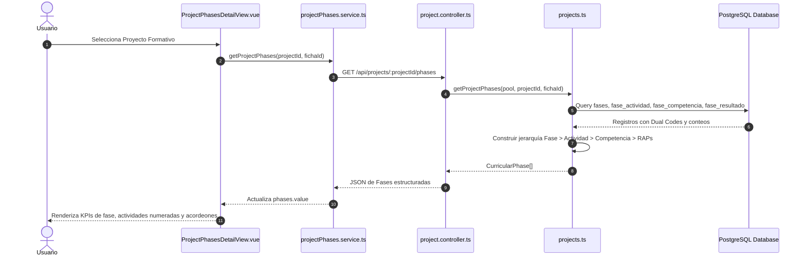

# 🔄 Casos de Uso - Módulo de Fases del Proyecto Formativo (Project Phases)

---

# CU-PHS-001: Consulta Jerárquica y Supervisión de Fases Formativas

## 1. Descripción
Permite al equipo docente y directivo explorar la estructura curricular del proyecto formativo dividida en 4 fases, visualizando las actividades de proyecto, competencias, RAPs y métricas de avance por ficha.

## 2. Actores
- **Principal**: Instructor Líder / Diseñador Curricular / Coordinador Académico
- **Secundario**: Servidor Backend (API PostgreSQL)

## 3. Precondiciones
- Existe al menos un proyecto formativo registrado en el sistema.
- El usuario accede a la vista `/phases`.

## 4. Diagrama de Secuencia

## 5. Flujo Principal (Happy Path)
1. El usuario ingresa a `/phases` y hace clic sobre una tarjeta de proyecto en la cuadrícula.
2. La vista monta `ProjectPhasesDetailView.vue` con el `projectId` correspondiente.
3. El frontend solicita en paralelo:
   - Fases y actividades estructuradas (`GET /api/projects/:projectId/phases`).
   - Estadísticas de aprendices y deserción (`GET /api/projects/:projectId/phase-learner-stats`).
   - Competencias no asignadas (`GET /api/projects/:projectId/unassigned`).
   - Fichas asociadas al programa (`GET /api/projects/:projectId/fichas`).
4. Por defecto, se selecciona la fase de **Análisis** (Fase 1).
5. Se renderizan las 4 tarjetas de KPIs: Actividades de Proyecto, Competencias Mapeadas, RAPs y Cumplimiento de Fase %.
6. Se despliegan las actividades de proyecto (ej. *Actividad 1*, *Actividad 2*).
7. Al hacer clic sobre una actividad o competencia, se abren los acordeones que listan los resultados de aprendizaje con sus códigos duales (`codigo_juicio`, `codigo_proyecto`), descripciones y estado de aprobación.
8. El usuario puede cambiar a las fases de **Planeación**, **Ejecución** o **Evaluación** mediante la barra de navegación superior.

## 6. Flujos Alternativos
- **A1: Filtrado por Ficha Específica**: El usuario selecciona una ficha en el selector desplegable. La vista recarga las fases y recalcula los aprendices aprobados y juicios esperados exclusivamente para dicha ficha.
- **A2: Filtrado por Estado de Competencias**: El usuario utiliza los botones de filtro rápido (*Aprobadas*, *Pendientes*) para mostrar solo las competencias con juicios pendientes en la fase activa.

## 7. Flujos de Excepción
- **E1: Proyecto sin fases**: Si el proyecto fue importado sin secciones de planeación válidas, se presenta un aviso invitando a reimportar el PDF o asignar competencias manualmente.

---

# CU-PHS-002: Asignación y Desasignación Matricial de Competencias

## 1. Descripción
Permite a un diseñador curricular o administrador vincular una competencia suelta a una o varias fases del proyecto formativo, o retirar una competencia de una fase.

## 2. Actores
- **Principal**: Diseñador Curricular / Administrador

## 3. Precondiciones
- El usuario se encuentra en la vista de detalle del proyecto (`ProjectPhasesDetailView.vue`).

## 4. Flujo Principal (Happy Path)
1. El usuario activa el botón **"Modo Asignación"** o navega a la pestaña **"Sueltas"** (`unassigned`).
2. Localiza la competencia deseada y presiona el botón **"Vincular Fase"** o **"Asignar a Fase"**.
3. Se abre el modal interactivo con las casillas de verificación para las 4 fases: Análisis, Planeación, Ejecución y Evaluación.
4. El usuario marca las casillas de las fases a las que pertenece la competencia y desmarca las que no aplican.
5. El usuario hace clic en **"Guardar Cambios"**.
6. El frontend detecta los cambios:
   - Para cada nueva fase marcada: Invoca `POST /api/projects/phases/:phaseId/competencies/:competencyId`.
   - Para cada fase desmarcada: Invoca `DELETE /api/projects/phases/:phaseId/competencies/:competencyId`.
7. El backend ejecuta las inserciones/eliminaciones en `fase_competencia` y `fase_resultado` de forma transaccional.
8. La vista se refresca automáticamente, actualizando las listas de competencias por fase y la lista de competencias sueltas.

## 5. Flujos de Excepción
- **E1: Error de red o conflicto en base de datos**: Si la petición falla, el sistema captura el error y emite una notificación de alerta sin corromper la jerarquía existente.

---

# CU-PHS-003: Análisis de Deserción Curricular por Fase

## 1. Descripción
Permite al Comité de Evaluación y a la coordinación académica analizar la retención estudiantil a lo largo de las 4 fases del proyecto formativo y examinar los aprendices que desertaron en cada fase.

## 2. Actores
- **Principal**: Comité de Evaluación / Coordinador Académico

## 3. Precondiciones
- El usuario accede al detalle del proyecto formativo y selecciona la pestaña **"Métricas de Aprendices"**.

## 4. Flujo Principal (Happy Path)
1. El usuario pulsa la pestaña **"Métricas de Aprendices"** en la barra de navegación del proyecto.
2. El sistema consulta `GET /api/projects/:projectId/phase-learner-stats`.
3. El backend ejecuta el algoritmo de deducción de desertores (`getPhaseLearnerStats`), comparando las marcas temporales de los aprendices retirados/trasladados contra las fechas de referencia de cada fase.
4. Se renderiza el gráfico de líneas de Chart.js mostrando la curva de deserción a lo largo de las 4 fases.
5. Debajo del gráfico, se despliegan tarjetas resumen por fase con:
   - Cantidad de desertores totales.
   - Desglose entre retiros voluntarios y traslados.
   - Porcentaje de cumplimiento real de la fase.
6. Al inspeccionar una fase, se visualiza la tabla detallada de aprendices desertores con:
   - Nombre completo y Documento de identidad.
   - Estado de retiro.
   - Última fecha de actividad evaluativa.
   - Código y nombre de la competencia y del resultado donde ocurrió la última evaluación.

## 5. Postcondiciones
- El comité dispone de datos empíricos y auditables sobre el punto exacto de abandono escolar para la toma de decisiones pedagógicas.
